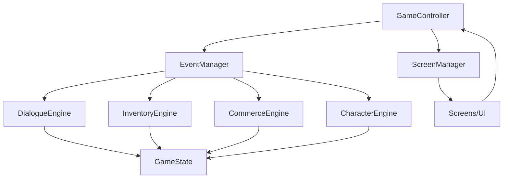

# project_context.md

## 1) Project Snapshot
- **Name:** Terror in Redstone
- **One-liner:** Professional-grade 2D RPG framework refactored from a monolithic Pygame prototype.
- **Primary language / runtime:** Python 3.11+
- **Main framework/libs:** Pygame (rendering & input), JSON (data), custom EventManager
- **Dev environment:** VS Code + Git (repo private by default)
- **Repo:** TODO (GitHub URL)

## 2) Purpose & Goals
- **Motivation:** Clean up a working prototype into a professional, extensible RPG framework.
- **Player-facing:** Tavern-centered narrative, branching dialogue, inventory/party management.
- **Dev-facing:** New content (NPCs, locations, quests) created with JSON only; minimal code changes.
- **Success criteria:**
  - ✅ Event-driven coordination via EventManager【150†source】
  - ✅ Dialogue system fully JSON-driven with 3+ conversation states【151†source】【160†source】
  - ✅ Engines are stateless, using GameState as the Single Data Authority【149†source】【164†source】
  - ✅ Shrink game_controller from 1000+ LOC to ~200 LOC【152†source】【162†source】

## 3) Non-Goals (current milestone)
- Multiplayer networking
- Combat engine (planned Session 7)
- World navigation system (planned Session 8)

## 4) Constraints & Assumptions
- **OS:** Windows, macOS, Linux
- **Input:** Keyboard/mouse (controller deferred)
- **Resolution policy:** Pixel-art scaling, fixed logical sizes for UI buttons (200px width standard)
- **Services:** Local-only, no network or backend

## 5) Architecture Overview

### 5.1 Core Layers【159†source】
- **Data Authority:** `game_state.py`, plus external JSONs under `/data`
- **Engines:** Pure business logic (`inventory_engine.py`, `dialogue_engine.py`, etc.)
- **Presentation:** Screens and UI components, pure rendering only
- **Coordination:** `game_controller.py` orchestrates, `event_manager.py` routes

### 5.2 Module Map (current + planned)
```
project_root/
  game_controller.py              # coordinator (shrinking)
  game_state.py                   # single source of truth
  game_logic/
    event_manager.py              # ✅ implemented
    inventory_engine.py           # ✅ refactored (stateless)
    data_manager.py               # ✅ loader/coordinator
    dialogue_engine.py            # enhanced for branching
    commerce_engine.py            # shop transactions
    character_engine.py           # stats & party
    content_loader.py             # (planned) config-driven loading
  ui/
    screen_manager.py             # (planned)
    input_handler.py              # (planned)
    screens/
      generic_dialogue.py         # (planned replacement)
      generic_location.py         # (planned)
  data/
    dialogues/tavern_garrick.json # ✅ 3-state branching【151†source】
    npcs/*.json                   # ✅ NPCs extracted【165†source】
    items.json
    content_config.json           # (future)
  utils/
    constants.py
    graphics.py
    overlay_utils.py
    dialogue_ui_utils.py
  tests/
    test_dialogue_engine.py
    test_inventory_engine.py
  docs/
    project_context.md
    decisions.md
```

### 5.3 Event Flow (simplified)


## 6) Data & Assets
- **Dialogue:** Stored in JSON under `/data/dialogues`, deep branching supported【151†source】
- **NPCs:** Standardized JSON schema (`id`, `name`, `description`, `level`, etc.)【165†source】
- **Locations:** Moving toward config-driven definitions in `content_config.json`【162†source】
- **Assets:** Referenced by logical IDs; loaded by `AssetManager` (planned)

## 7) Event Catalog (current)
- `NPC_CLICKED`
- `DIALOGUE_STARTED`, `DIALOGUE_CHOICE`, `DIALOGUE_ENDED`
- `ITEM_PURCHASED`, `ITEM_SOLD`, `INVENTORY_CHANGED`
- `SCREEN_CHANGE`
- `SAVE_REQUESTED`, `LOAD_REQUESTED`【150†source】

## 8) Build, Run, Test
- **Install:** `pip install -r requirements.txt`
- **Run:** `python game_controller.py`
- **Test:** `pytest`
- **Package:** PyInstaller (planned)

## 9) Observability
- EventManager keeps history of last 50 events【150†source】
- Debug logging toggleable; add structured trace output (planned)

## 10) Risks & Open Questions
- Ongoing `game_controller.py` refactor to cut duplication
- Robustness of JSON schema validation
- Testing coverage for Dialogue + DataManager
- Future expansion: QuestEngine, CombatEngine【156†source】

## 11) Changelog
- **Aug 25:** NPC extraction complete【165†source】
- **Sep 1:** Architecture roadmap revised【163†source】
- **Sep 3:** Garrick branching dialogue tested and validated【160†source】
- **Sep 3:** EventManager fully integrated【150†source】