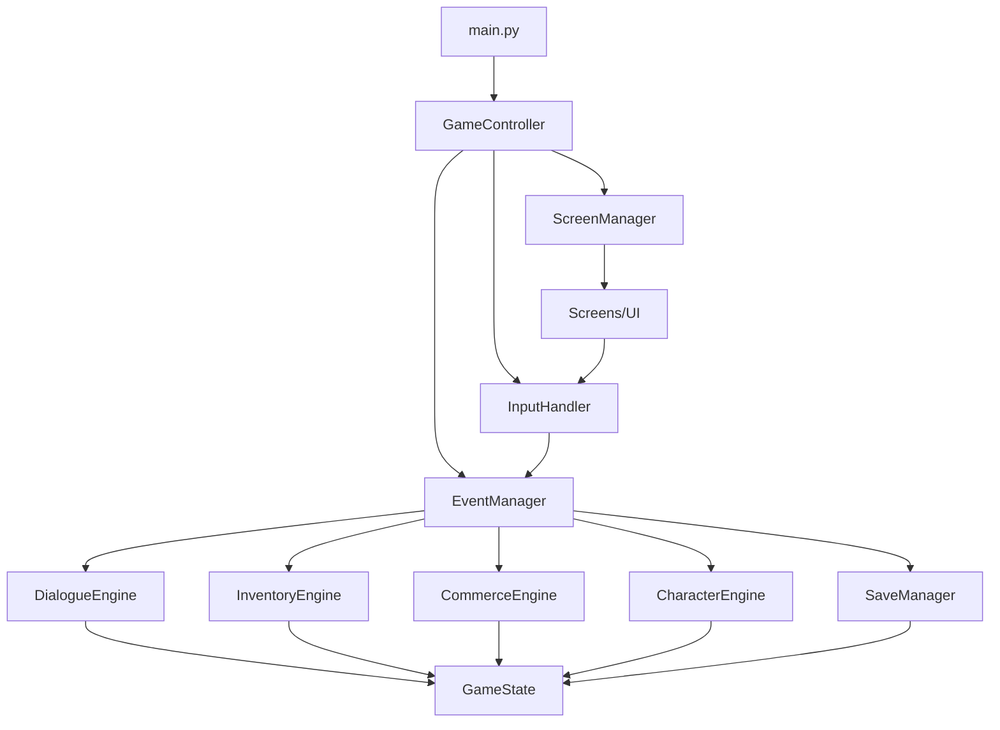

# Terror in Redstone - Project Context

## 1) Project Snapshot
- **Name:** Terror in Redstone
- **One-liner:** Professional-grade 2D RPG framework evolved from monolithic Pygame prototype to event-driven architecture
- **Primary language / runtime:** Python 3.11+
- **Main framework/libs:** Pygame (rendering & input), JSON (data), custom EventManager
- **Dev environment:** VS Code + Git (repo private by default)
- **Current Status:** Production-ready character creation, tavern system, and overlay infrastructure

## 2) Purpose & Goals
- **Motivation:** Transform working prototype into professional, extensible RPG framework ready for rapid content expansion
- **Player-facing:** Tavern-centered narrative, branching dialogue, inventory/party management, quest tracking
- **Dev-facing:** New content (NPCs, locations, quests) created with JSON only; minimal code changes required
- **Success criteria:**
  - ✅ **Event-driven coordination via EventManager** (Complete - Sep 2025)
  - ✅ **Dialogue system fully JSON-driven** with 3+ conversation states and branching (Complete)
  - ✅ **Professional patron NPC system** with event-driven architecture (Complete)
  - ✅ **Engines are stateless**, using GameState as Single Data Authority (Complete)
  - ✅ **Character creation modernization** with semantic action architecture (Complete - Sep 2025)
  - ✅ **Save/Load system modernization** with event-driven overlay management (Complete - Sep 2025)
  - 🎯 **ScreenManager refactoring** from 1000+ lines to modular overlay architecture (In Progress)

## 3) Current Development Phase
**Active Focus:** Screen Architecture Refactoring (Phase 1 of 3)
- **Immediate Goal:** Replace bloated ScreenManager with professional tabbed overlay system
- **Timeline:** 8-10 sessions across 3 phases
- **Expected Outcome:** 60-70% code reduction in screen management with standardized patterns

### Non-Goals (current milestone)
- Multiplayer networking
- Combat engine (planned for future phases)
- World navigation system (planned for future phases)

## 4) Constraints & Assumptions
- **OS:** Windows, macOS, Linux
- **Input:** Keyboard/mouse (controller support deferred)
- **Resolution policy:** Pixel-art scaling, fixed logical sizes for UI buttons (200px width standard)
- **Services:** Local-only, no network or backend dependencies

## 5) Architecture Overview

### 5.1 Core Layers (Established Architecture)
- **Data Authority:** `game_state.py` as single source of truth, plus external JSONs under `/data`
- **Engines:** Pure business logic (`inventory_engine.py`, `dialogue_engine.py`, `character_engine.py`, `save_manager.py`)
- **Presentation:** Screens and UI components, pure rendering only
- **Coordination:** `game_controller.py` orchestrates, `event_manager.py` routes events
- **Input Management:** `input_handler.py` provides semantic action abstraction

### 5.2 Component Responsibility Boundaries (Professional Standards)
**Clear Separation of Concerns:**
- **Engines:** Domain/business logic only (Character, Inventory, Commerce, Dialogue, SaveManager)
- **ScreenManager:** Navigation flow and UI state management 
- **GameController:** Pure coordination without business logic (50% reduction achieved)
- **InputHandler:** Semantic action system replacing hardcoded click handling

**Event Routing Patterns:**
- **Domain Events → Engines:** Business logic processing
- **UI Events → ScreenManager:** Navigation and display state
- **Cross-cutting → EventManager:** Centralized event hub

### 5.3 File Structure (Current - Production Ready)
```
Terror in Redstone/
├── main.py                     # Clean entry point with application lifecycle
├── game_state.py              # Single data authority with comprehensive state
├── core/
│   ├── game_controller.py     # Thin coordinator (reduced from 1000+ to ~400 lines)
│   ├── event_manager.py       # Professional event hub
│   ├── input_handler.py       # Semantic action system
│   └── save_manager.py        # Complete save/load business logic
├── screens/                   # Event-driven screen modules
│   ├── character_creation.py  # Fully modernized with semantic actions
│   ├── title_menu.py         # Professional title and menu system
│   ├── tavern.py             # Complete tavern with NPC recruitment
│   ├── inventory.py          # Professional overlay (target for refactoring)
│   ├── quest_log.py          # Quest tracking overlay (target for refactoring)
│   ├── character_sheet.py    # Character display overlay (target for refactoring)
│   ├── help_screen.py        # Help system overlay (target for refactoring)
│   ├── save_game.py          # Modernized save overlay
│   ├── load_game.py          # Modernized load overlay
│   └── shopping.py           # Professional merchant system
├── ui/
│   ├── screen_manager.py     # Screen lifecycle and overlay management (target for refactoring)
│   ├── generic_dialogue_handler.py  # Universal NPC conversation system
│   └── screen_handlers.py    # Click handling registration
├── data/
│   ├── dialogues/            # JSON-driven conversation trees
│   │   ├── tavern_garrick.json
│   │   └── tavern_[patron].json
│   ├── player/
│   │   ├── character_names.json    # Dynamic name generation
│   │   └── character_classes.json  # Class definitions and mechanics
│   └── npcs/                 # NPC data definitions
├── utils/
│   ├── constants.py          # Game constants and configuration
│   ├── graphics.py           # Reusable drawing utilities
│   └── overlay_utils.py      # Shared overlay functionality
└── assets/
    ├── fonts/                # MedievalSharp with fallback protection
    └── images/               # Standardized artwork pipeline
```

### 5.4 Event-Driven Architecture (Established Patterns)
**Professional Screen Registration:**
```python
screen_manager.register_render_function("stats", draw_stats_screen,
    enter_hook=lambda _: self.register_stats_screen_clickables())
```
- Screens self-register clickable regions on entry
- ScreenManager stays generic (no hardcoded screen names)
- Follows Open/Closed Principle for extensibility

**Semantic Action System:**
```python
# Instead of hardcoded coordinates
input_handler.register_semantic_action("START_GAME", start_button_rect)
# Routes to
event_manager.emit("START_GAME", {"source": "main_menu"})
```

### 5.5 Current Event Flow


## 6) Data & Content Management
- **Dialogue:** Comprehensive JSON system under `/data/dialogues` with deep branching and requirements
- **NPCs:** Standardized JSON schema with `id`, `name`, `description`, `level`, recruitment status
- **Character Classes:** JSON-driven class system with abilities, comments, and educational features
- **Save System:** Professional file management with metadata, character portraits, and state persistence
- **Items:** Structured item data with categories, icons, and equipment mechanics

## 7) Recent Major Achievements (Sep 2025)

### Architecture Modernization Complete
- **Character Creation System:** Full modernization with semantic action architecture across 8 screens
- **Save/Load Systems:** Event-driven overlay management with proper business logic separation  
- **Input System:** Professional semantic action system replacing hardcoded click handling
- **Event Architecture:** Comprehensive EventManager hub with proper component decoupling

### Code Quality Improvements
- **GameController Reduction:** 1000+ lines → ~400 lines (60% reduction achieved)
- **Dependency Injection:** Professional 3-phase initialization following game engine patterns
- **Separation of Concerns:** Clean boundaries between engines, presentation, and coordination
- **Error Handling:** Comprehensive safety nets and graceful degradation

### User Experience Enhancements
- **Context-Sensitive Input:** Intelligent hotkey blocking preventing UI conflicts
- **Professional Overlays:** Consistent save/load experience with proper state management
- **Educational Systems:** Class-aware character creation with guidance and warnings
- **Robust Save System:** Complete character data persistence with portraits and metadata

## 8) Active Development: Screen Architecture Refactoring

### Current Challenge
**ScreenManager Bloat:** 1000+ lines with 20+ specialized registration methods
- Multiple `register_*_clickables()` methods for each screen type
- Inconsistent overlay management patterns
- Difficult maintenance and extension

### Solution: Professional Tabbed Overlay System
**3-Phase Refactoring Roadmap:**

**Phase 1: Tabbed Overlay Foundation (Sessions 1-5)**
- Create `BaseTabbedOverlay` class with keyboard navigation
- Convert Help (1 tab), Character (2 tabs), Quest (2 tabs), Inventory (4 tabs)
- **Target:** 75% reduction in overlay registration methods

**Phase 2: Modal Dialog System (Sessions 6-7)**  
- Standardize confirmation and file dialogs
- Separate modal behavior from content overlays
- **Target:** Consistent dialog patterns across system

**Phase 3: Location Screen System (Sessions 8-10)**
- Create `BaseLocation` class for tavern-style interactions
- Data-driven location configuration
- **Target:** Template system for rapid location creation

### Expected Outcomes
- **Code Reduction:** ScreenManager 1000+ lines → ~300-400 lines (60-70% reduction)
- **Maintainability:** Adding overlays becomes configuration, not coding
- **Consistency:** All overlays follow identical interaction patterns
- **Scalability:** Framework ready for rapid content expansion

## 9) Success Metrics & Current Status

### Technical Excellence (Achieved)
- ✅ **Modular Architecture:** Clean separation across 15+ modules
- ✅ **Event-Driven Design:** Professional EventManager coordination
- ✅ **Code Quality:** Industry-standard patterns and error handling
- ✅ **Performance:** Consistent 60 FPS with efficient rendering
- ✅ **Beginner-Friendly:** Clear structure for learning and modification

### Framework Maturity (In Progress)
- ✅ **Data-Driven Content:** JSON-based NPCs, dialogue, and character classes
- ✅ **Professional Save System:** Complete state persistence with metadata
- ✅ **Semantic Input:** Universal action system for all user interactions
- 🎯 **Overlay Standardization:** Target of current refactoring phase
- 📋 **Location Templates:** Planned for Phase 3

### Development Velocity (Target)
- 🎯 **New NPCs:** JSON file creation only (no code changes)
- 🎯 **New Locations:** Configuration-based setup
- 🎯 **New Overlays:** Base class extension with minimal custom code
- 🎯 **Content Expansion:** Framework supports rapid iteration

---

*This document reflects the current state as of September 2025, with active development focused on completing the screen architecture refactoring initiative. The project has successfully transitioned from prototype to professional framework status, with robust foundations ready for content expansion.*