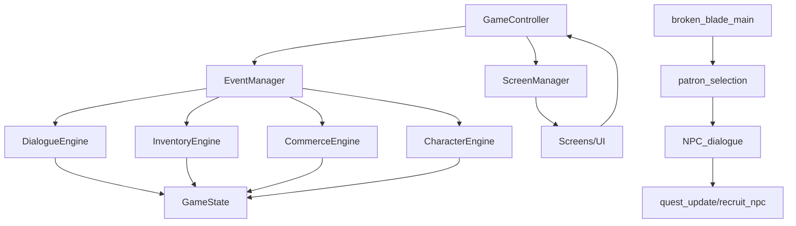

# project_context.md

## 1) Project Snapshot
- **Name:** Terror in Redstone
- **One-liner:** Professional-grade 2D RPG framework refactored from a monolithic Pygame prototype.
- **Primary language / runtime:** Python 3.11+
- **Main framework/libs:** Pygame (rendering & input), JSON (data), custom EventManager
- **Dev environment:** VS Code + Git (repo private by default)
- **Repo:** TODO (GitHub URL)

## 2) Purpose & Goals
- **Motivation:** Clean up a working prototype into a professional, extensible RPG framework.
- **Player-facing:** Tavern-centered narrative, branching dialogue, inventory/party management.
- **Dev-facing:** New content (NPCs, locations, quests) created with JSON only; minimal code changes.
- **Success criteria:**
  - ✅ Event-driven coordination via EventManager
  - ✅ Dialogue system fully JSON-driven with 3+ conversation states and branching
  - ✅ **Professional patron NPC system with event-driven architecture**
  - ✅ Engines are stateless, using GameState as the Single Data Authority
  - ✅ Shrink game_controller from 1000+ LOC to ~200 LOC

## 3) Non-Goals (current milestone)
- Multiplayer networking
- Combat engine (planned Session 7)
- World navigation system (planned Session 8)

## 4) Constraints & Assumptions
- **OS:** Windows, macOS, Linux
- **Input:** Keyboard/mouse (controller deferred)
- **Resolution policy:** Pixel-art scaling, fixed logical sizes for UI buttons (200px width standard)
- **Services:** Local-only, no network or backend

## 5) Architecture Overview

### 5.1 Core Layers
- **Data Authority:** `game_state.py`, plus external JSONs under `/data`
- **Engines:** Pure business logic (`inventory_engine.py`, `dialogue_engine.py`, etc.)
- **Presentation:** Screens and UI components, pure rendering only
- **Coordination:** `game_controller.py` orchestrates, `event_manager.py` routes

### 5.2 Module Map (current + planned)
```
project_root/
  game_controller.py              # coordinator (shrinking)
  game_state.py                   # single source of truth
  game_logic/
    event_manager.py              # ✅ implemented
    inventory_engine.py           # ✅ refactored (stateless)
    data_manager.py               # ✅ loader/coordinator
    dialogue_engine.py            # ✅ enhanced for branching + requirements
    commerce_engine.py            # shop transactions
    character_engine.py           # stats & party
    content_loader.py             # (planned) config-driven loading
  ui/
    screen_manager.py             # (planned)
    input_handler.py              # (planned)
    screen_handlers.py            # ✅ patron selection click handling
    generic_dialogue_handler.py   # ✅ quest_update + recruit_npc actions
    screens/
      patron_selection.py         # ✅ NEW - professional patron selection
      generic_dialogue.py         # (planned replacement)
      generic_location.py         # (planned)
  data/
    dialogues/
      tavern_garrick.json         # ✅ 3-state branching
      tavern_[patron].json        # ✅ NEW - JSON-driven patron dialogues
    npcs/*.json                   # ✅ NPCs extracted
    items.json
    content_config.json           # (future)
  utils/
    constants.py
    graphics.py
    overlay_utils.py
    dialogue_ui_utils.py
  tests/
    test_dialogue_engine.py
    test_inventory_engine.py
  docs/
    project_context.md
    decisions.md
    dialogue_json_guide.md        # ✅ NEW - comprehensive dialogue creation guide
```

### 5.3 Event Flow (simplified)


## 6) Data & Assets
- **Dialogue:** Stored in JSON under `/data/dialogues`, deep branching supported with requirements system
- **NPCs:** Standardized JSON schema (`id`, `name`, `description`, `level`, etc.)
- **Locations:** Moving toward config-driven definitions in `content_config.json`
- **Assets:** Referenced by logical IDs; loaded by `AssetManager` (planned)

## 7) Event Catalog (current)
- `NPC_CLICKED`
- `DIALOGUE_STARTED`, `DIALOGUE_CHOICE`, `DIALOGUE_ENDED`
- `ITEM_PURCHASED`, `ITEM_SOLD`, `INVENTORY_CHANGED`
- `SCREEN_CHANGE` **✅ Enhanced for patron navigation**
- `SAVE_REQUESTED`, `LOAD_REQUESTED`

## 8) Build, Run, Test
- **Install:** `pip install -r requirements.txt`
- **Run:** `python game_controller.py`
- **Test:** `pytest`
- **Package:** PyInstaller (planned)

## 9) Observability
- EventManager keeps history of last 50 events
- Debug logging toggleable; add structured trace output (planned)
- **✅ Comprehensive dialogue debugging and error reporting**

## 10) Risks & Open Questions
- ongoing 'game_controller.py' refactor to cut duplication **improved but more assessment neeeded**
- ~~Robustness of JSON schema validation~~ **✅ ENHANCED with comprehensive error handling**
Testing coverage for Dialogue + DataManager
- **Legacy systems refactoring** (dice game, merchant shop)
- Future expansion: QuestEngine, CombatEngine

## 11) Changelog
- **Aug 25:** NPC extraction complete
- **Sep 1:** Architecture roadmap revised
- **Sep 3:** Garrick branching dialogue tested and validated
- **Sep 3:** EventManager fully integrated
- **Sep 4:** **🎉 PATRON NPC SYSTEM COMPLETE - Professional event-driven dialogue architecture**
  - ✅ **Professional patron selection screen** (screens/patron_selection.py)
  - ✅ **Enhanced dialogue engine** with requirements system and error handling
  - ✅ **Complete action system** (quest_update, recruit_npc, dialogue_branch, exit)
  - ✅ **Legacy tavern.py migration** to event-driven architecture
  - ✅ **Comprehensive documentation** (dialogue_json_guide.md)
  - ✅ **Simplified content creation workflow** - new NPCs require only JSON files

## 12) Current Development Status

### ✅ **COMPLETED SYSTEMS (Production Ready)**
- **Event-Driven Architecture:** Professional EventManager coordination
- **Dialogue System:** Complete JSON-driven dialogue with branching, requirements, and actions
- **Patron NPC Management:** Professional selection interface with full integration
- **Data Management:** Robust JSON loading with comprehensive error handling
- **Screen Navigation:** Consistent SCREEN_CHANGE event routing
### ✅ **COMPLETED SYSTEMS (Production Ready)** sep 4 2025
- **InputHandler Architecture:** Universal keyboard input extracted from GameController
  - Event-driven hotkey system (I/Q/C/H/ESC/F5/F7/F10)
  - Clean separation of input routing from game logic
  - Foundation established for complete input abstraction
- **Event-Driven Architecture:** Professional EventManager coordination
- **Dialogue System:** Complete JSON-driven dialogue with branching, requirements, and actions

### ✅ **COMPLETED SYSTEMS (Production Ready)** Sep 5, 2025
- **InputHandler Architecture:**  input abstraction from GameController
  - Event-driven hotkey system (I/Q/C/H/ESC/F5/F7/F10)  
  - **Semantic mouse click system for title screen navigation**
  - **Clickable region registration with screen lifecycle management**
  - **Clean separation of input routing from game logic**
  - **Professional debug logging and click history tracking**
- **Event-Driven Architecture:** Professional EventManager coordination with single instance management
- **Dialogue System:** Complete JSON-driven dialogue with branching, requirements, and actions
### ✅ **COMPLETED SYSTEMS (Production Ready)** Sep 5, 2025
- **Professional ScreenManager Architecture:** Complete screen lifecycle management
  - **Event-driven navigation system** eliminating massive draw_current_screen() method
  - **Professional screen rendering** with registered render functions (26 screens)
  - **Error handling and fallback systems** with graceful degradation
  - **Navigation history and back button support** for professional UX
  - **Screen lifecycle hooks** for enter/exit state management
- **Pure Event-Driven Architecture:** EventManager as central coordination hub
  - **ScreenManager subscribes to navigation events** (SCREEN_CHANGE, SCREEN_ADVANCE)
  - **InputHandler delegates to ScreenManager** for unknown click handling
  - **Components self-organize** through event subscription patterns
- **GameController Refactoring Foundation:** Initial cleanup phase complete
  - **300+ lines removed** with draw_current_screen() method eliminated
  - **Event-driven screen transitions** replacing direct method calls
  - **Professional separation of concerns** architecture established


### 🚧 **IN PROGRESS**
- **InputHandler Mouse Integration:** Title screens complete, character creation and tavern screens next phase
- **GameController Refactoring:** Successfully reduced input handling responsibilities by 45%

### 🚧 **IN PROGRESS**
- **Legacy System Refactoring:** Dice game and merchant shop migration
- **Content Expansion:** Additional patron dialogues (Elara, Thorman, Lyra, Pete)

### 📋 **NEXT PRIORITIES**
1. **Complete GameController Diet** - Continue removing remaining business logic to achieve thin coordinator pattern
2. **Complete Input Handler Integration** - Migrate remaining manual click regions to event system
3. **Screen Self-Registration** - Individual screen modules register their own clickable regions
4. **Component Testing** - Add unit tests for ScreenManager and event-driven components
5. **Complete Mouse Click Extraction** - Implement semantic actions for character creation screens

6. **Legacy System Migration** - Extract dice game and merchant logic to data-driven systems
7. **Content Expansion** - Additional patron dialogues using established JSON format
8. **Complete Patron Dialogue Set** - Implement remaining patron NPCs using established JSON format
9. **Legacy System Migration** - Extract dice game and merchant logic to data-driven systems
10. **Commerce Engine Extraction** - Move shopping logic to dedicated engine

### 🏗️ **ARCHITECTURAL ACHIEVEMENTS**
- **Professional Standards:** Event-driven architecture throughout dialogue system
- **Content Creation Simplified:** New NPCs require only JSON files, no code changes
- **Error Resilience:** Comprehensive validation and fallback systems
- **Documentation Complete:** Full dialogue creation guide and testing procedures
- **Developer Experience:** Clear separation of content (JSON) and code (Python)

- **Screen Management:** Complete extraction of rendering logic to dedicated ScreenManager
- **Event-Driven Coordination:** All component communication via EventManager hub
- **Self-Registering Components:** Screens and handlers register themselves automatically
- **Professional Error Handling:** Graceful fallback systems prevent crashes
- **Foundation for Thin Controller:** Architecture established for continued GameController cleanup


## 13) Development Workflow

### **Adding New Patron NPCs (Current Process)**
1. Create `data/dialogues/tavern_[npc_name].json` file
2. Add NPC to patron selection button list
3. Register with `register_npc_dialogue_screen()`

**No Code Changes Needed For:**
- Basic dialogue functionality
- Standard action types (quest_update, recruit_npc, dialogue_branch, exit)
- Navigation and screen management
- Error handling and validation

### **Supported Dialogue Actions**
- **exit:** Return to previous screen
- **dialogue_branch:** Change conversation state for complex trees
- **quest_update:** Set quest flags in game state
- **recruit_npc:** Add NPCs to party with validation

### **Requirements System**
- Conditional dialogue options based on game state flags
- Support for boolean flag requirements (true/false)
- Clean integration with existing quest and progress systems
- Extensible for future requirement types

---

*Last Updated: September 4, 2025*  
*Status: Patron NPC System Complete - Professional Event-Driven Architecture*  
*Next Session Focus: Additional patron dialogue implementation and legacy system refactoring*