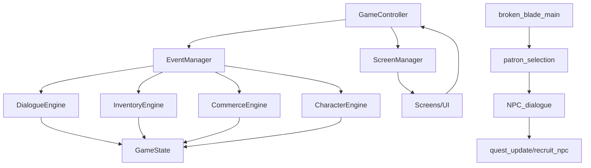

# project_context.md

## 1) Project Snapshot
- **Name:** Terror in Redstone
- **One-liner:** Professional-grade 2D RPG framework refactored from a monolithic Pygame prototype.
- **Primary language / runtime:** Python 3.11+
- **Main framework/libs:** Pygame (rendering & input), JSON (data), custom EventManager
- **Dev environment:** VS Code + Git (repo private by default)
- **Repo:** TODO (GitHub URL)

## 2) Purpose & Goals
- **Motivation:** Clean up a working prototype into a professional, extensible RPG framework.
- **Player-facing:** Tavern-centered narrative, branching dialogue, inventory/party management.
- **Dev-facing:** New content (NPCs, locations, quests) created with JSON only; minimal code changes.
- **Success criteria:**
  - ✅ Event-driven coordination via EventManager
  - ✅ Dialogue system fully JSON-driven with 3+ conversation states and branching
  - ✅ **Professional patron NPC system with event-driven architecture**
  - ✅ Engines are stateless, using GameState as the Single Data Authority
  - 🚧 Shrink game_controller from 1000+ LOC to ~200 LOC (significant progress)

## 3) Non-Goals (current milestone)
- Multiplayer networking
- Combat engine (planned Session 7)
- World navigation system (planned Session 8)

## 4) Constraints & Assumptions
- **OS:** Windows, macOS, Linux
- **Input:** Keyboard/mouse (controller deferred)
- **Resolution policy:** Pixel-art scaling, fixed logical sizes for UI buttons (200px width standard)
- **Services:** Local-only, no network or backend

## 5) Architecture Overview

### 5.1 Core Layers
- **Data Authority:** `game_state.py`, plus external JSONs under `/data`
- **Engines:** Pure business logic (`inventory_engine.py`, `dialogue_engine.py`, `character_engine.py`)
- **Presentation:** Screens and UI components, pure rendering only
- **Coordination:** `game_controller.py` orchestrates, `event_manager.py` routes

### 5.2 Component Responsibility Boundaries (Established Sep 2025)
**Engines vs. ScreenManager Distinction:**
- **Engines:** Domain/business logic only (Character, Inventory, Commerce, Dialogue)
- **ScreenManager:** Navigation flow and UI state management 
- **GameController:** Pure coordination without business logic

**Event Routing Patterns:**
- **Domain Events → Engines:** NEW_GAME, REROLL_STATS, SELECT_MALE/FEMALE → CharacterEngine
- **Navigation Events → ScreenManager:** START_GAME, CONTINUE, LOAD_GAME → ScreenManager
- **Decision Framework:** Business logic → Engine; Navigation → ScreenManager; GameController coordinates only

**Key Principle:** Don't create engines for UI concerns (avoid MenuEngine/NavigationEngine that duplicate ScreenManager)

### 5.3 Module Map (current + planned)
```
project_root/
  game_controller.py              # coordinator (shrinking - diet successful)
  game_state.py                   # single source of truth
  game_logic/
    event_manager.py              # ✅ implemented
    inventory_engine.py           # ✅ refactored (stateless)
    data_manager.py               # ✅ loader/coordinator
    dialogue_engine.py            # ✅ enhanced for branching + requirements
    commerce_engine.py            # shop transactions
    character_engine.py           # ✅ stats & party + character creation flow
    content_loader.py             # (planned) config-driven loading
  ui/
    screen_manager.py             # ✅ screen lifecycle & navigation
    input_handler.py              # ✅ semantic action system
    screen_handlers.py            # ✅ patron selection click handling
    generic_dialogue_handler.py   # ✅ quest_update + recruit_npc actions
    screens/
      patron_selection.py         # ✅ NEW - professional patron selection
      generic_dialogue.py         # (planned replacement)
      generic_location.py         # (planned)
  data/
    dialogues/
      tavern_garrick.json         # ✅ 3-state branching
      tavern_[patron].json        # ✅ NEW - JSON-driven patron dialogues
    npcs/*.json                   # ✅ NPCs extracted
    items.json
    content_config.json           # (future)
  utils/
    constants.py
    graphics.py
    overlay_utils.py
    dialogue_ui_utils.py
  tests/
    test_dialogue_engine.py
    test_inventory_engine.py
  docs/
    project_context.md
    decisions.md
    dialogue_json_guide.md        # ✅ NEW - comprehensive dialogue creation guide
```

### 5.4 Enter Hooks Pattern (Established)
**Professional Screen Registration:**
```python
screen_manager.register_render_function("stats", draw_stats_screen,
    enter_hook=lambda _: self.register_stats_screen_clickables())
```
- Screens self-register clickable regions on entry
- ScreenManager stays generic (no hardcoded screen names)
- Follows Open/Closed Principle

### 5.5 Event Flow (simplified)


## 6) Data & Assets
- **Dialogue:** Stored in JSON under `/data/dialogues`, deep branching supported with requirements system
- **NPCs:** Standardized JSON schema (`id`, `name`, `description`, `level`, etc.)

## 11) Screen Architecture (Enhanced)

### **Character Creation Modernization (New)**
- **Stats Screen:** Semantic actions (REROLL_STATS, KEEP_STATS) with CharacterEngine event handling
- **Gender Screen:** Semantic actions (SELECT_MALE, SELECT_FEMALE) with proper navigation flow
- **Input System:** Two-tier architecture - semantic actions for complex screens, direct events for simple navigation

### **Professional Dialogue System (Enhanced)**
- **Patron NPC Management:** Professional selection interface with full integration
- **JSON-Driven Content:** NPCs require only JSON files, no code changes
- **Branching Support:** Multi-state conversations with requirements system
- **Event-Driven Architecture:** Complete separation of content (JSON) and code (Python)

## 12) Current Development Status

### ✅ **COMPLETED SYSTEMS (Production Ready)** Sep 5, 2025
- **Event-Driven Architecture:** Professional EventManager coordination with single instance management
- **Character Creation Modernization:** Stats and gender screens use semantic action system
- **Navigation Architecture:** START_GAME/CONTINUE/LOAD_GAME properly moved to ScreenManager
- **Input Handler Architecture:** Semantic mouse click system with clickable region registration
- **Screen Management:** Enter hooks pattern with professional lifecycle management
- **GameController Diet:** Significant progress removing business logic (7+ methods eliminated)

## ✅ COMPLETED SYSTEMS (Production Ready) Sep 6, 2025
**Complete Name Selection Architecture:** Professional three-screen workflow modernization
Dynamic name generation from JSON data with gender-specific options
Event-driven name selection with semantic actions (SELECT_NAME_1, SELECT_NAME_2, SELECT_NAME_3)
Unified text input processing through InputHandler for custom name entry
Professional screen lifecycle with enter hooks and clickable region registration
Clean state management with text clearing on back navigation

**Unified Input Architecture:** Complete migration to single input processing pathway
InputHandler processes ALL input (mouse clicks and keyboard text) through EventManager
Eliminated dual input pathways by migrating legacy GameController text input
Consistent event format with action field standardization across all screens
Professional text input handling with character limits and validation
**JSON-Based Content Management:** Data-driven name generation system
Expandable name database in data/player/character_names.json
Gender-specific name pools with configurable first/last name combinations
Special name guarantees (Garlen Sliverblade for male characters)
Content updates without code changes for easy expansion

✅ **COMPLETED SYSTEMS (Production Ready) Sep 6, 2025**
Portrait Selection Architecture Complete: Professional event-driven portrait selection with semantic actions (SELECT_PORTRAIT_1-5, CONFIRM_PORTRAIT, BACK_FROM_PORTRAIT). Dynamic 5-portrait grid with yellow selection highlighting and personalized character name display. Complete business logic migration from GameState to CharacterEngine with proper dependency injection patterns.
Character Creation Modernization Status: Stats, Gender, Name workflow (3 screens), and Portrait selection fully modernized using event-driven architecture. Gold and Trinket screens remain for completion using established semantic action pattern.
Architectural Cleanup Progress: Portrait business logic methods moved from GameState to CharacterEngine. SaveManager updated with proper dependency injection instead of tight import coupling. GameController diet continued with portrait method elimination (~4 methods removed).
Professional Standards Achieved: Complete separation of UI rendering, event handling, business logic, and data storage. InputHandler processes all input through EventManager to appropriate engines. ScreenManager handles lifecycle with enter hooks for automatic clickable registration.

**Completed Screens:** Stats (with class awareness), Gender, Name workflow (3 screens), Portrait selection, Gold, and Trinket screens fully modernized using event-driven architecture
Latest Achievement: Advanced educational low stats warning system with class-specific personality elements. Stats screen now displays class information dynamically from JSON data with primary ability highlighting to guide player decisions.
Architectural Patterns Established

**Class-Aware Character Creation:** JSON-driven character class system supporting future expansion
**Educational UX Design:** Warning systems that teach game mechanics while respecting player choice
Dynamic Content Management: Class-specific comments and data loaded from JSON for easy content updates
Multi-State Screen Flow: Complex confirmation workflows with conditional clickable registration
Professional Event Architecture: Sophisticated state management for educational feedback systems
🔄 NEXT SESSION PRIORITIES
GameController Diet Completion - Continue extracting business logic to appropriate engines
Component Testing - Add unit tests for event-driven character creation components

**Latest Achievement:** Summary Screen Modernization Complete - Final character creation screen now displays JSON-calculated HP, character portrait, and complete character data with event-driven START GAME navigation. Character creation modernization project complete with all screens using professional semantic action architecture.

**Completed Screens:** Stats (with class awareness), Gender, Name workflow (3 screens), Portrait selection, Gold, Trinket, and Summary screens fully modernized using event-driven architecture

Sep 7 Session Achievement: Save Game Overlay Modernization Complete
Architecture Status: Professional event-driven overlay system established
Technical Accomplishments
Save System Modernization: Complete migration from legacy click handling to event-driven architecture following load game template. All save overlay operations now use semantic events (SAVE_SLOT_SELECTED, SAVE_GAME_CONFIRM, SAVE_SCREEN_CANCEL) with proper business logic separation.
Input System Standardization: Fixed hotkey mappings to restore original design (F5=quick save, F7=save menu, F10=load menu). Save overlay properly integrated with universal input system and overlay lifecycle management.
UI Architecture Consistency: Save overlay now matches load overlay patterns exactly - ScreenManager handles lifecycle, InputHandler routes clicks, SaveManager processes business logic. Fixed-position button registration ensures reliable click handling.
Current System Status
Completed Overlays: Load game (F10) and save game (F7) fully modernized with event-driven architecture
Remaining Modernization: Inventory (I), quest log (Q), character sheet (C), help (H) overlays using established template
Next Priority: Button issues in broken_blade_main screen requiring investigation and modernization

## 🔄 ARCHITECTURAL ACHIEVEMENTS
Character Creation Screen Modernization: Stats, Gender, and complete Name workflow using event-driven architecture
Input Processing Unification: Single responsibility pathway through InputHandler for all user input
Event-Driven Component Communication: EventManager hub coordination with semantic action routing
JSON Content Management: Data separation enabling non-programmer content updates
Professional UX Patterns: Consistent state management and navigation flow

## 📋 NEXT PRIORITIES
Portrait Selection Screen Modernization - Apply proven semantic action pattern to character portrait selection
Remaining Character Creation Screens - Gold, Trinket, Summary screens using established pattern
Complete GameController Diet - Continue removing business logic to achieve thin coordinator pattern
Component Testing - Add unit tests for event-driven character creation components
Content Expansion - Additional name options and portrait assets using JSON-driven approach

## Pattern Established for Character Creation Screens:
ScreenManager registers clickables using enter hooks with exact coordinates from draw functions
InputHandler converts all input (mouse/keyboard) to semantic events with consistent data format
CharacterEngine handles business logic and navigation through EventManager
GameState serves as single data authority
JSON files enable content updates without code modifications

### 🚧 **IN PROGRESS**
- **GameController Refactoring:** Continue extracting remaining business logic to appropriate engines

### 📋 **NEXT PRIORITIES**
1. **Complete Character Creation Modernization** - Apply semantic action pattern to remaining screens
2. **Professional Debug Tools** - Implement F2 GameState inspection system
3. **Screen Self-Registration** - Continue eliminating hardcoded screen logic
4. **Component Testing** - Add unit tests for ScreenManager and event-driven components

### 🗽 **ARCHITECTURAL ACHIEVEMENTS**
- **Professional Standards:** Event-driven architecture with clear component boundaries
- **Separation of Concerns:** UI, business logic, and coordination properly separated
- **Extensible Patterns:** Enter hooks and semantic actions established for consistent screen handling
- **Clean Architecture:** Components self-organize through events rather than direct coupling

## 13) Development Workflow

### **Adding New Patron NPCs (Current Process)**
1. Create `data/dialogues/tavern_[npc_name].json` file
2. Add NPC to patron selection button list
3. Register with `register_npc_dialogue_screen()`

**No Code Changes Needed For:**
- Basic dialogue functionality
- Standard action types (quest_update, recruit_npc, dialogue_branch, exit)
- Navigation and screen management
- Error handling and validation

### **Character Creation Screen Modernization (Established Pattern)**
1. Add event handlers to CharacterEngine `register_character_creation_events()`
2. Add clickable registration method to ScreenManager
3. Update screen registration to use enter hooks
4. Test semantic action flow

### **Supported Dialogue Actions**
- **exit:** Return to previous screen
- **dialogue_branch:** Change conversation state for complex trees
- **quest_update:** Set quest flags in game state
- **recruit_npc:** Add NPCs to party with validation

### **Requirements System**
- Conditional dialogue options based on game state flags
- Support for boolean flag requirements (true/false)
- Clean integration with existing quest and progress systems
- Extensible for future requirement types

---

*Last Updated: September 5, 2025*  
*Status: Character Creation Modernization Phase - Professional Event-Driven Architecture*  
*Next Session Focus: Portrait/name screen modernization and continued GameController cleanup*